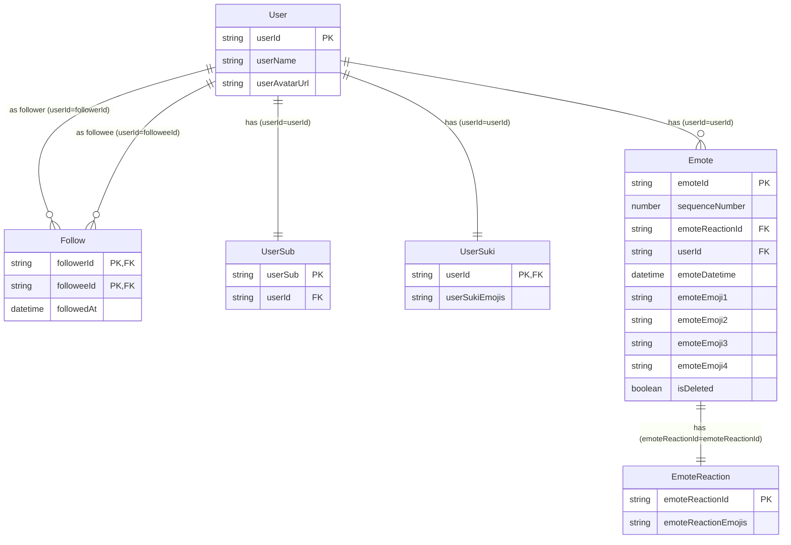
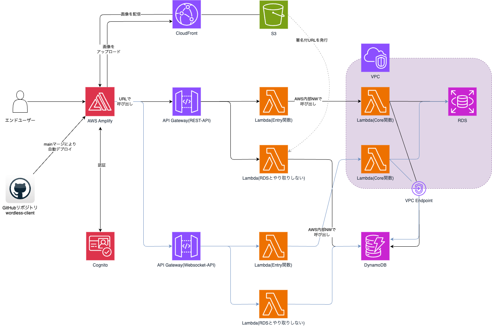

# wordless-client

## リポジトリの概要

本リポジトリは絵文字で繋がるSNS Wordless のフロントエンド実装です。
構成は、 **Next.js App Router** です。
以下のURLからログインできます。サンプルログインでお試し出来ます。

<https://wordless-sns.com/>

バックエンドリポジトリ（REST-API）は[こちら](https://github.com/kagamaru/wordless-backend-rest-api)です。

バックエンドリポジトリ（WebSocket-API）は[こちら](https://github.com/kagamaru/wordless-backend-websocket-api)です。

## プロジェクトの目的

Wordlessは「言葉のないSNS」をテーマに、感情の共有をシンプルなUIで実現する実験的プロダクトです。
このプロジェクトを通して、モダンなフロントエンド技術（Next.js App Router / React Query / PandaCSSなど）の実践的理解を深めることと、インフラストラクチャを含む設計〜実装までを個人で行い、スキルアップすることを目的としています。

## エレベーターピッチ

| 項目名                                   | 説明                                                               |
| ---------------------------------------- | ------------------------------------------------------------------ |
| 潜在的なニーズ、潜在的な課題             | 論争、炎上を避けて人と繋がりたい                                   |
| 対象顧客                                 | 既存のSNSに疲れた人向けの                                          |
| プロダクト名                             | Wordlessは                                                         |
| プロダクトのカテゴリ                     | SNSサイトです。                                                    |
| 重要な利点、対価に見合う説得力のある理由 | これは絵文字で会話することで、情報でではなく感情のやり取りが出来、 |
| 代替手段の最右翼                         | X（旧Twitter）と違って                                             |
| 差別化の決定的な特徴                     | 炎上や議論が発生しない特徴が備わっています                         |

## リポジトリの技術要素

| 実現機能                    | パッケージ名                                                         | バージョン |
| --------------------------- | -------------------------------------------------------------------- | ---------- |
| Webアプリケーション構築     | [Next.js App Router](https://nextjs.org/)                            | 15.0.4     |
| テスト                      | [Vitest](https://vitest.dev/)                                        | 3.0.8      |
| 状態管理                    | [Zustand](https://zustand.docs.pmnd.rs/getting-started/introduction) | 5.0.5      |
| キャッシュ管理、API呼び出し | [React Query](https://tanstack.com/query/latest)                     | 5.69.0     |
| コンポーネントライブラリ    | [AntDesign](https://ant.design/)                                     | 5.22.5     |
| CSSプリプロセッサ           | [panda css](https://panda-css.com/)                                  | 0.49.0     |
| モッキング                  | [Mock Service Worker](https://mswjs.io/)                             | 2.7.3      |
| コードフォーマット          | [prettier](https://prettier.io/)                                     | 3.4.2      |
| コードの静的解析            | [eslint](https://eslint.org/)                                        | 8.57.1     |

## 技術的要素の採用理由

### React, Next.js App Router

- 本アプリケーションはSNSサイトである。SNSサイトでは、何度もサイトを訪問して使用する特性上、高速なレスポンスが求められる。また、アプリケーション内で管理する状態（State）も多いと考えられたので、SPAやSSRというアーキテクチャを採用した。
- 本アプリケーションは、転職活動に向けたポートフォリオとして作成する一面もあったため、エンタープライズ向けアプリケーションでの採用実績が多い React および Next.js を採用した。
- Next.js App Router については、まだ React Server Components に完全に対応していないライブラリも多い現実があるものの、"use client" を付与して使う保守的な選択肢があることも鑑み、今後のRSCの普及にも耐えられる選択肢として採用した。

### Next.js API Routes

- Next.js App Routerの機能の1つで、`route.ts` というファイルを作成することで、当該パスに対して API Request を行うことができる。
- Next.js の機能をフルに活用するため、試験的に採用した。
- バックエンドのAPIを呼ぶ場所を分離出来るのは良い点である。また、バックエンド側のURLをオープンにする必要が無くなるため、セキュリティ的にも強くなっていると考えられる。
- しかし、画面→Next.js API Routes→バックエンドAPI という流れになるため、呼び出し用の関数が2つ必要となり、呼び出し時の処理の複雑化を招きやすい点には注意が必要と考える。

### Zustand

- エモート（投稿）の管理に状態管理ライブラリを用いる必要があった。
- 状態管理ライブラリには複数の選択肢（Jotai、Recoil など）があったが、その中でも記述がシンプルなZustandを採用している。

### React Query

- 開発当初は useEffect でデータを取得していた。
- しかし、上記のパターンはいわゆるフェッチウォーターフォール問題を起こしやすく、パフォーマンスの低下を招きやすい。
- そのため、React Queryを採用し、パフォーマンスを低下させず、データの取得を容易にした。

### Vitest

- Next.js の公式ドキュメントで単体テストフレームワークとして紹介されているため、それに則って採用した。

### AntDesign

- 時間が限られ、ヒューマンリソースも少ない個人開発では、CSSを1から用意して外観を作成することは現実的ではないため、UIコンポーネントライブラリを採用した。
- ReactベースのUIコンポーネントライブラリといえば[Material UI](https://mui.com/)だが、こちらは過去に使用した経験があったため、採用を見送った。
- Ant Design は海外において人気が高く、習熟する価値のあるライブラリであると感じられたため採用した。

### PandaCSS

- 基本的に AntDesign の中で用意されているコンポーネントから外観を作成していたものの、状況によっては独自のレイアウトやデザインを採用したい場面もあることから、CSSによる外観の変更も必要と考えた。
- コンポーネント内で外観の記載を完結させることが可能な CSS in JS を採用しようと考え、開発初期は記法のシンプルさからEmotionに惹かれていた。
- だが、Runtime CSS in JS と Next.js App Router の相性が良くないため、最終的に ZeroRuntimeCSSinJS かつ、記法が Emotionに似ている PandaCSS を採用した。

## 評価点

### 良い点

| 課題 / Before                                                                                                                   | 解決策 / After                                                                                                                                                                                                                          | 効果                                                                                       |
| ------------------------------------------------------------------------------------------------------------------------------- | --------------------------------------------------------------------------------------------------------------------------------------------------------------------------------------------------------------------------------------- | ------------------------------------------------------------------------------------------ |
| ヒューマンリソースや時間が限られている。また、絵文字で繋がるSNSというコンセプト自体がウケるかわからない                         | リーンソフトウェア開発を意識し、製品の魅力を伝えるのに必要最低限の機能を実装した。ログイン周りやパスワード変更などの実装は最小限に                                                                                                      | アプリケーションとして最低限動作はしつつも、製品のコンセプトは伝わる状態になった           |
| 開発に伴い技術的負債が発生するため、リファクタリングにも耐えうる構造にする必要がある                                            | 命令網羅率72.85%、分岐網羅率73.68%を達成。また、テスト戦略として[TestingTrophy](https://kentcdodds.com/blog/the-testing-trophy-and-testing-classifications)を意識し、単体テストでも統合テストのような画面単位での出力検証を重視している | リファクタリングを躊躇なく行えるようになり、品質・スピードともに向上                       |
| フロントエンドでは最大・最小の文字数での外観の検証を行う必要がある                                                              | Mock Service Workerによってレスポンスをmockし、データの挿入を容易にした                                                                                                                                                                 | 外観の検証を容易にし、時間を短縮                                                           |
| SNSアプリでは、隣の人が「いいね」すると自分の画面にもその「いいね」数が反映されるなど、リアルタイム性のあるやり取りが必要である | WebSocketによってリアルタイム性の実現                                                                                                                                                                                                   | リアルタイム性のあるやり取りが実現。ただし、スマートフォン使用時の挙動はまだ不安定         |
| アプリケーション内に共通の外観を持つ部品が複数個存在する。また、HTMLのコードが長くなりやすい                                    | 外観を可能な限りコンポーネント化                                                                                                                                                                                                        | コンポーネント化により、再利用性、可読性が向上。また、HTMLのコードが短くなり、保守性が向上 |
| 環境変数が正しくセットされていない場合、実際に使用してみるまでエラーがわからない                                                | 環境変数をenvConfigに集約し、Falsyな値だった場合はエラーを発生させる                                                                                                                                                                    | デプロイ後に正しく動作しなかったとしても、原因の切り分けが容易に                           |
| ユーザーはスマートフォンから使用することが多いと考えられ、レスポンシブデザインの実現が必要である                                | スマートフォン表示かどうか判定するメソッドをカスタムフック化。CSS in JS と併用することにより、細かに外観を調整                                                                                                                          | PCでもスマートフォンでも快適に操作可能なUIを実現                                           |

### 改善が必要な点と今後の展望

| 改善が必要な点                                           | 問題                                               | 今後の展望                                                                                             |
| -------------------------------------------------------- | -------------------------------------------------- | ------------------------------------------------------------------------------------------------------ |
| トークンをlocalStorageに保存                             | XSS攻撃に脆弱でセキュリティが弱い                  | HttpOnlyCookieによる認証のセキュア化                                                                   |
| 複雑かつ過剰なエラーハンドリング                         | 保守性の低下。バグの温床にもなりやすい             | throw errorを中心としたハンドリングをやめる                                                            |
| panda css と ant design 同時採用によるcssのカオス化      | !important乱用による保守性の低下                   | !important の撲滅                                                                                      |
| 本番環境へのデプロイが職人技に依存                       | 再現性のあるデプロイメントが難しい                 | Terraformによる環境構築の自動化                                                                        |
| WebSocketがテスト困難                                    | 実際に起動してみるまで問題が生じているか分からない | JavaScriptのAPIではなく、外製のライブラリを使うことでMock化などを容易にする                            |
| 絵文字の追加が難しい                                     | ユーザーの要望を反映するのに時間がかかる　         | アプリケーションに静的情報として保持するのではなく、S3にJSON形式で保存し、起動時に読み込む方式としたい |
| 新規参画者にどのようなコンポーネントがあるのか分からない | 開発への参入障壁が高い                             | Storybookでコンポーネントをカタログ化する                                                              |

## ER図

## システム構成図

## 画面一覧

| ダッシュボード画面                                              | エモート投稿画面                                              | コンセプト画面                                                    | ユーザー情報表示画面                                              |
| --------------------------------------------------------------- | ------------------------------------------------------------- | ----------------------------------------------------------------- | ----------------------------------------------------------------- |
| /(main)/dashboard.png>) | /(main)/post/post.png>) | /(main)/concept/concept.png>) | /(main)/user/user.png>) |

| ユーザー名変更画面                                                                        | ユーザースキ登録画面                                                                        | ユーザーパスワード変更画面                                                                    | ユーザーパスワード変更完了画面                                                                                 |
| ----------------------------------------------------------------------------------------- | ------------------------------------------------------------------------------------------- | --------------------------------------------------------------------------------------------- | -------------------------------------------------------------------------------------------------------------- |
| /(main)/user/registration/userName/userName.png>) | /(main)/user/registration/userSuki/userSuki.png>) | /(main)/user/settings/password/password.png>) | /(main)/user/settings/password/completion/completion.png>) |

| ユーザー削除画面                                                                        | ユーザー削除完了画面                                                                                     | エラー画面                                   | ログイン画面(ログインタブ)                                                        |
| --------------------------------------------------------------------------------------- | -------------------------------------------------------------------------------------------------------- | -------------------------------------------- | --------------------------------------------------------------------------------- |
| /(main)/user/settings/deleteUser/deleteUser.png>) | /(deleteUser)/deleteUser/completion/deleteUserCompletion.png>) | /error.png>) | /auth/login/login(loginTab).png>) |

| ログイン画面(ユーザー登録タブ)                                                         | 確認コード検証画面                                                                                 | ユーザー情報登録画面                                                                 | ユーザー画像登録画面                                                                          |
| -------------------------------------------------------------------------------------- | -------------------------------------------------------------------------------------------------- | ------------------------------------------------------------------------------------ | --------------------------------------------------------------------------------------------- |
| /auth/login/login(signupTab).png>) | /auth/registration/confirmationCode/confirmationCode.png>) | /auth/registration/userInfo/userInfo.png>) | /auth/registration/[userId]/userIcon/userIcon.png>) |

| パスワードリセット-メールアドレス入力画面                                                                       | パスワードリセット-新しいパスワード入力画面                                                                                   | パスワードリセット完了画面                                                                       | 404画面                                       |
| --------------------------------------------------------------------------------------------------------------- | ----------------------------------------------------------------------------------------------------------------------------- | ------------------------------------------------------------------------------------------------ | --------------------------------------------- |
| /auth/forgetPassword/emailInput/emailInput.png>) | /auth/forgetPassword/newPasswordInput/newPasswordInput.png>) | /auth/forgetPassword/completion/completion.png>) | /not-found.png>) |

## URL設計

### 画面

| 画面名                                      | URL                                          |
| ------------------------------------------- | -------------------------------------------- |
| ダッシュボード画面                          | `/`                                          |
| エモート投稿画面                            | `/post`                                      |
| コンセプト画面                              | `/concept`                                   |
| ユーザー情報表示画面                        | `/user/:userId`                              |
| ユーザー名変更画面                          | `/user/:userId/registration/userName`        |
| ユーザースキ登録画面                        | `/user/:userId/registration/usersuki`        |
| ユーザーパスワード変更画面                  | `/user/:userId/settings/password`            |
| ユーザーパスワード変更完了画面              | `/user/:userId/settings/password/completion` |
| ユーザー削除画面                            | `/user/:userId/settings/deleteUser`          |
| ユーザー削除完了画面                        | `/deleteUser/completion`                     |
| エラー画面                                  | `/error`                                     |
| ログイン画面                                | `/auth/login`                                |
| 確認コード検証画面                          | `/auth/registration/confirmationCode`        |
| ユーザー情報登録画面                        | `/auth/registration/userInfo`                |
| ユーザー画像登録画面                        | `/auth/registration/userIcon`                |
| パスワードリセット-メールアドレス入力画面   | `/auth/forgetPassword/emailInput`            |
| パスワードリセット-新しいパスワード入力画面 | `/auth/forgetPassword/newPasswordInput`      |
| パスワードリセット完了画面                  | `/auth/forgetPassword/completion`            |

### Next.js API Routes

| API名                                               | URL                           | メソッド名 |
| --------------------------------------------------- | ----------------------------- | ---------- |
| エモート群-取得API                                  | `/api/emote`                  | GET        |
| エモート-削除API                                    | `/api/emote/:emoteId`         | DELETE     |
| フォロワー-取得API                                  | `/api/follow/:userId`         | GET        |
| フォロワー-登録API                                  | `/api/follow/:userId`         | POST       |
| フォロワー-削除API                                  | `/api/follow/:userId`         | DELETE     |
| ユーザー情報-取得API                                | `/api/user/:userId`           | GET        |
| ユーザー情報-登録API                                | `/api/user/:userId`           | POST       |
| ユーザー情報-削除API                                | `/api/user/:userId`           | DELETE     |
| ユーザー名-登録API                                  | `/api/user/:userId/userName`  | POST       |
| ユーザー画像-登録API                                | `/api/userImage/:userId`      | POST       |
| ユーザーサブ-登録API                                | `/api/userSub/:userId`        | POST       |
| ユーザースキ-取得API                                | `/api/userSuki/:userId`       | GET        |
| ユーザースキ-登録API                                | `/api/userSuki/:userId`       | POST       |
| 認証-パスワード変更-登録API                         | `/api/cognito/changePassword` | POST       |
| 認証-パスワードを忘れた場合-新しいパスワード登録API | `/api/cognito/forgotPassword` | POST       |
| 認証-ユーザー登録-確認コード検証API                 | `/api/cognito/confirmSignup`  | POST       |
| 認証-ユーザー削除-削除API                           | `/api/cognito/deleteUser`     | DELETE     |
| 認証-パスワードを忘れた場合-登録API                 | `/api/cognito/forgotPassword` | POST       |
| 認証-ログイン-登録API                               | `/api/cognito/login`          | POST       |
| 認証-ユーザー登録-登録API                           | `/api/cognito/signup`         | POST       |

### REST API

| API名                | URL                      | メソッド名 |
| -------------------- | ------------------------ | ---------- |
| エモート群-取得API   | `/emotes`                | GET        |
| エモート-削除API     | `/emotes/:emoteId`       | DELETE     |
| フォロワー-取得API   | `/follow/:userId`        | GET        |
| フォロワー-登録API   | `/follow/:userId`        | POST       |
| フォロワー-削除API   | `/follow/:userId`        | DELETE     |
| ユーザー情報-取得API | `/user/:userId`          | GET        |
| ユーザー情報-登録API | `/user/:userId`          | POST       |
| ユーザー情報-削除API | `/user/:userId`          | DELETE     |
| ユーザー名-登録API   | `/user/:userId/userName` | POST       |
| ユーザー画像-登録API | `/userImage/:userId`     | POST       |
| ユーザーサブ-登録API | `/userSub/:userId`       | POST       |
| ユーザースキ-取得API | `/userSuki/:userId`      | GET        |
| ユーザースキ-登録API | `/userSuki/:userId`      | POST       |

## 環境変数の一覧

| 変数名                                      | 説明                                             |
| ------------------------------------------- | ------------------------------------------------ |
| NEXT_PUBLIC_WEBSOCKET_URL                   | WebSocketのURL                                   |
| NEXT_PUBLIC_CLOUDFRONT_URL                  | CloudFrontのURL                                  |
| NEXT_PUBLIC_API_MOCKING                     | API Mockingの有効/無効。mock起動時以外はdisabled |
| REST_API_URL                                | REST APIのURL                                    |
| REGION_AWS                                  | AWSのリージョン                                  |
| COGNITO_CLIENT_ID                           | CognitoのクライアントID                          |
| NEXT_PUBLIC_SAMPLE_USER_NOZOMI_MAIL_ADDRESS | サンプルユーザーのメールアドレス                 |
| NEXT_PUBLIC_SAMPLE_USER_NOZOMI_PASSWORD     | サンプルユーザーのパスワード                     |
| NEXT_PUBLIC_SAMPLE_USER_NOZOMI_USER_ID      | サンプルユーザーのユーザーID                     |
| NEXT_PUBLIC_SAMPLE_USER_NOZOMI_USER_SUB     | サンプルユーザーのユーザーサブ                   |
| NEXT_PUBLIC_SAMPLE_USER_NICO_MAIL_ADDRESS   | サンプルユーザーのメールアドレス                 |
| NEXT_PUBLIC_SAMPLE_USER_NICO_PASSWORD       | サンプルユーザーのパスワード                     |
| NEXT_PUBLIC_SAMPLE_USER_NICO_USER_ID        | サンプルユーザーのユーザーID                     |
| NEXT_PUBLIC_SAMPLE_USER_NICO_USER_SUB       | サンプルユーザーのユーザーサブ                   |
